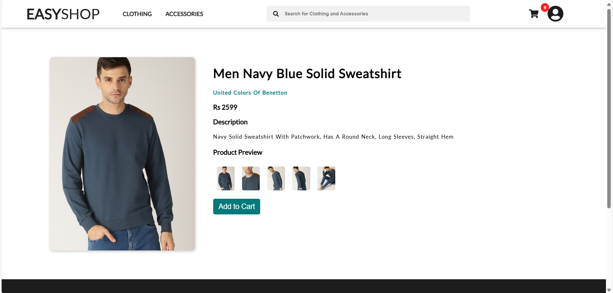

# E-Commerce Website 

This is a simple e-commerce website . The website includes features like product listing, product details, and a shopping cart. The project is built using HTML, CSS, and JavaScript, with data fetched from a mock API .

## Features

- **Product Listing**: Displays clothing and accessories for men and women.
- **Product Details**: Shows detailed information about a selected product, including images, description, and price.
- **Shopping Cart**: Allows users to add products to the cart and view the total amount.
- **Order Placement**: Users can place an order, which is simulated by a simple order confirmation page.

## Screenshots

